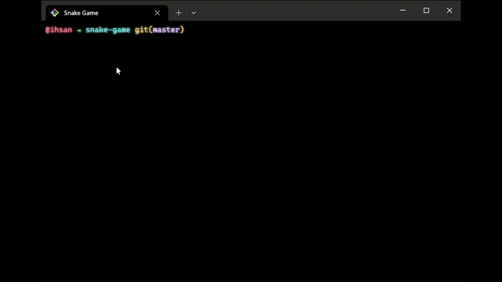

# Snake Game
- Nostalgic snake game built using Node.js on the terminal!

## How to play
- Clone the repository and open the cloned project in your terminal.
- Execute `node .` to play and enjoy!
- Press 'Q' or ^C (CTRL + C or CMD + C) to quit game.

## Gameplay
- 
